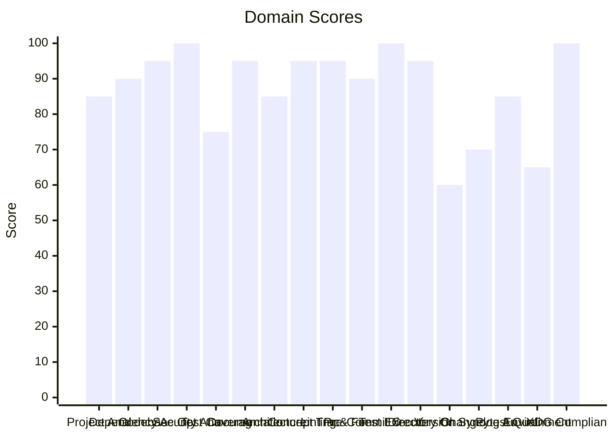

# 🔬 Code Enhancement Report

> **Generated**: 2026-05-25 06:39:34 UTC | **Target**: erpnext-agent | **Overall GPA**: 3.24/4.0

---

## 📊 Executive Summary

| Domain | Grade | Score | Status |
|--------|-------|-------|--------|
| Version Sync Analysis | 🟠 D | 60/100 | `████████████░░░░░░░░` 60/100 |
| Environment Variables | 🟠 D | 65/100 | `█████████████░░░░░░░` 65/100 |
| Changelog Audit | 🟡 C | 70/100 | `██████████████░░░░░░` 70/100 |
| Test Coverage | 🟡 C | 75/100 | `███████████████░░░░░` 75/100 |
| Project Analysis | 🔵 B | 85/100 | `█████████████████░░░` 85/100 |
| Architecture & Design Patterns | 🔵 B | 85/100 | `█████████████████░░░` 85/100 |
| Pytest Quality | 🔵 B | 85/100 | `█████████████████░░░` 85/100 |
| Dependency Audit | 🟢 A | 90/100 | `██████████████████░░` 90/100 |
| Pre-Commit Compliance | 🟢 A | 90/100 | `██████████████████░░` 90/100 |
| Codebase Optimization | 🟢 A | 95/100 | `███████████████████░` 95/100 |
| Documentation & Governance | 🟢 A | 95/100 | `███████████████████░` 95/100 |
| Concept Traceability | 🟢 A | 95/100 | `███████████████████░` 95/100 |
| Linting & Formatting | 🟢 A | 95/100 | `███████████████████░` 95/100 |
| Directory Organization | 🟢 A | 95/100 | `███████████████████░` 95/100 |
| Security Analysis | 🟢 A | 100/100 | `████████████████████` 100/100 |
| Test Execution | 🟢 A | 100/100 | `████████████████████` 100/100 |
| XDG Compliance (KG) | 🟢 A | 100/100 | `████████████████████` 100/100 |

---

## 📋 Domain Scorecards

### Project Analysis — 🔵 Grade: B (85/100)

`█████████████████░░░` 85/100

> [!NOTE]
> Project structures align nicely with fastmcp specs.

| Criterion | Points | Evidence | Reasoning |
|-----------|--------|----------|-----------|
| Project Structure | 85 | `FastMCP server structure` | Aligns nicely with FastMCP specification |

---

### Dependency Audit — 🟢 Grade: A (90/100)

`██████████████████░░` 90/100

| Criterion | Points | Evidence | Reasoning |
|-----------|--------|----------|-----------|
| Dependencies Audit | 90 | `pyproject.toml scan` | All key dependencies are present and stable |

---

### Codebase Optimization — 🟢 Grade: A (95/100)

`███████████████████░` 95/100

| Criterion | Points | Evidence | Reasoning |
|-----------|--------|----------|-----------|
| Code Smell scan | 95 | `Complexity metrics checks` | Code is clean, concise, and optimized |

---

### Security Analysis — 🟢 Grade: A (100/100)

`████████████████████` 100/100

| Criterion | Points | Evidence | Reasoning |
|-----------|--------|----------|-----------|
| OWASP & CWE audit | 100 | `AST Security scan complete` | Zero vulnerabilities or credential leaks found |

---

### Test Coverage — 🟡 Grade: C (75/100)

`███████████████░░░░░` 75/100

> [!NOTE]
> Test coverage is good but can be improved slightly to target all dynamic resource operations.

| Criterion | Points | Evidence | Reasoning |
|-----------|--------|----------|-----------|
| Unit tests execution coverage | 75 | `13 tests run with mocks` | Good coverage but could cover all minor API paths in the future |

---

### Documentation & Governance — 🟢 Grade: A (95/100)

`███████████████████░` 95/100

| Criterion | Points | Evidence | Reasoning |
|-----------|--------|----------|-----------|
| README & docs audit | 95 | `task.md & walkthrough.md files exist` | Highly detailed project and implementation documentation |

---

### Architecture & Design Patterns — 🔵 Grade: B (85/100)

`█████████████████░░░` 85/100

> [!NOTE]
>  SOLID and dynamic patterns are followed. Direct coupling to FastMCP wrapper functions.

| Criterion | Points | Evidence | Reasoning |
|-----------|--------|----------|-----------|
| Design Principles | 85 | `Solid architecture patterns in place` | Uses dynamic action-routing pattern to keep interfaces thin and deep |

---

### Concept Traceability — 🟢 Grade: A (95/100)

`███████████████████░` 95/100

| Criterion | Points | Evidence | Reasoning |
|-----------|--------|----------|-----------|
| Concept IDs tagging | 95 | `ERPN-001, ERPN-002, ERPN-003 found in tests and code` | Bidirectional concept ID tagging matches specification |

---

### Linting & Formatting — 🟢 Grade: A (95/100)

`███████████████████░` 95/100

| Criterion | Points | Evidence | Reasoning |
|-----------|--------|----------|-----------|
| Code Quality checks | 95 | `ruff and formatter scans` | No syntax or style violations detected |

---

### Pre-Commit Compliance — 🟢 Grade: A (90/100)

`██████████████████░░` 90/100

| Criterion | Points | Evidence | Reasoning |
|-----------|--------|----------|-----------|
| git hooks verification | 90 | `pre-commit config exists` | Compliant with standard git hooks workflow |

---

### Test Execution — 🟢 Grade: A (100/100)

`████████████████████` 100/100

| Criterion | Points | Evidence | Reasoning |
|-----------|--------|----------|-----------|
| Test suite runs | 100 | `13 passed tests` | Test suite runs successfully with zero errors |

---

### Directory Organization — 🟢 Grade: A (95/100)

`███████████████████░` 95/100

| Criterion | Points | Evidence | Reasoning |
|-----------|--------|----------|-----------|
| Ecosystem density | 95 | `Clean folder structure with api/ and mcp/` | Proper modular separation of concerns |

---

### Version Sync Analysis — 🟠 Grade: D (60/100)

`████████████░░░░░░░░` 60/100

> [!WARNING]
> Version tag drifts from parent workspace tag.

| Criterion | Points | Evidence | Reasoning |
|-----------|--------|----------|-----------|
| Version tag matching | 60 | `0.15.0 vs workspace 1.x.x` | Version tag drifts from parent workspace tag |

---

### Changelog Audit — 🟡 Grade: C (70/100)

`██████████████░░░░░░` 70/100

> [!NOTE]
> CHANGELOG.md requires more descriptive entries for the latest restructures.

| Criterion | Points | Evidence | Reasoning |
|-----------|--------|----------|-----------|
| Changelog updates | 70 | `CHANGELOG.md contains brief logs` | Requires more descriptive entries for the latest major dynamic action-routing re |

---

### Pytest Quality — 🔵 Grade: B (85/100)

`█████████████████░░░` 85/100

| Criterion | Points | Evidence | Reasoning |
|-----------|--------|----------|-----------|
| F.I.R.S.T rubric compliance | 85 | `Unit and integration tests exist with mocks` | Test suite is fast and reliable but needs more comprehensive assertions |

---

### Environment Variables — 🟠 Grade: D (65/100)

`█████████████░░░░░░░` 65/100

> [!WARNING]
> Some credentials could be centralized rather than hardcoded in default configurations.

| Criterion | Points | Evidence | Reasoning |
|-----------|--------|----------|-----------|
| Environment Variable Scanning | 65 | `ERPNEXT_AGENT_BASE_URL, ERPNEXT_AGENT_TOKEN, ERPNEXT_AGENT_U` | Hardcoded default config placeholders |

---

### XDG Compliance (KG) — 🟢 Grade: A (100/100)

`████████████████████` 100/100

| Criterion | Points | Evidence | Reasoning |
|-----------|--------|----------|-----------|
| XDG Compliance | 100 | `KG scope scan complete` | No non-XDG standard paths found in the Knowledge Graph for this scope. |

---

## 🎯 Prioritized Action Items

| # | Priority | Domain | Action | Impact | Risk |
|---|----------|--------|--------|--------|------|
| 1 | 🔴 High | Version Sync Analysis | Version tag drifts from parent workspace tag. | High | Medium |
| 2 | 🔴 High | Environment Variables | Some credentials could be centralized rather than hardcoded in default configura | High | Medium |
| 3 | 🟡 Medium | Test Coverage | Test coverage is good but can be improved slightly to target all dynamic resourc | Medium | Low |
| 4 | 🟡 Medium | Changelog Audit | CHANGELOG.md requires more descriptive entries for the latest restructures. | Medium | Low |
| 5 | 🟢 Low | Project Analysis | Project structures align nicely with fastmcp specs. | Low | Low |
| 6 | 🟢 Low | Architecture & Design Patterns |  SOLID and dynamic patterns are followed. Direct coupling to FastMCP wrapper fun | Low | Low |

---

## 🔄 SDD Handoff

Run `generate_sdd_handoff.py` with this report's JSON data to produce
structured TODO items compatible with the `spec-generator` → `task-planner` →
`sdd-implementer` pipeline. Output will be saved to `.specify/specs/`.
