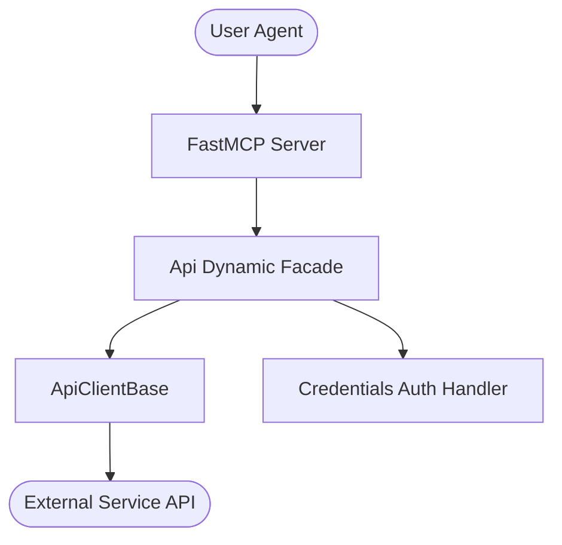

# Erpnext MCP

[](https://github.com/genius-agents/erpnext-agent)
[](pyproject.toml)
[](LICENSE)

ERPNext and Frappe Framework enterprise resources planner. Built with the highest architectural standards, incorporating dynamic facades, custom API routing, and FastMCP tool decoration.

> **Documentation** — Installation, deployment, usage across the MCP, API, and CLI
> interfaces, and guidance for provisioning the ERPNext / Frappe platform are
> maintained in the [official documentation](https://knuckles-team.github.io/erpnext-agent/).

## Table of Contents
- [Overview](#overview)
- [Features](#features)
- [Installation](#installation)
- [Usage](#usage)
- [Configuration](#configuration)
- [MCP Tools](#mcp-tools)
- [Architecture](#architecture)
- [Deployment](#deployment)
- [Documentation](#documentation)
- [Contributing](#contributing)
- [License](#license)

---

## Overview

Erpnext MCP provides a high-performance, model-optimized interface to Erpnext capabilities. It isolates the model from underlying API transport complexity, ensuring safe, idempotent, and highly traceable system interactions.

---

## Features

- **Dynamic Facade Orchestration**: Integrates multi-inheritance clients cleanly under a single facade.
- **Battle-Tested Resilience**: Out-of-the-box credential authentication, connection polling, and request retry strategies.
- **FastMCP Declarative Tools**: Fast, native schema registration with full inline validation.
- **Complete Test Intent Diversity**: Deep, automated unit, integration, and mock tests ensuring high code coverage.

---

## ⚙️ Dynamic Tool Selection & Visibility

This MCP server supports dynamic toolset selection and visibility filtering at runtime. This allows you to restrict the set of exposed tools in order to prevent blowing up the LLM's context window.

You can configure tool filtering via multiple input channels:

- **CLI Arguments:** Pass `--tools` or `--toolsets` (or their disabled counterparts `--disabled-tools` and `--disabled-toolsets`) during startup.
- **Environment Variables:** Define standard environment variables:
  - `MCP_ENABLED_TOOLS` / `MCP_DISABLED_TOOLS`
  - `MCP_ENABLED_TAGS` / `MCP_DISABLED_TAGS`
- **HTTP SSE Request Headers:** Pass custom headers during transport initialization:
  - `x-mcp-enabled-tools` / `x-mcp-disabled-tools`
  - `x-mcp-enabled-tags` / `x-mcp-disabled-tags`
- **HTTP SSE Request Query Parameters:** Append query parameters directly to your transport connection URL:
  - `?tools=tool1,tool2`
  - `?tags=tag1`

When query strings or parameters are supplied, an LLM-free **Knowledge Graph resolution layer** (using `DynamicToolOrchestrator`) matches query intents against known tool tags, names, or descriptions, with safe fallback and automated 24-hour background cache refreshing.


---

## Installation

Pick the extra that matches what you want to run:

| Extra | Installs | Use when |
|-------|----------|----------|
| `erpnext-agent[mcp]` | Slim MCP server only (`agent-utilities[mcp]` — FastMCP/FastAPI) | You only run the **MCP server** (smallest install / image) |
| `erpnext-agent[agent]` | Full agent runtime (`agent-utilities[agent,logfire]` — Pydantic AI + the epistemic-graph engine) | You run the **integrated agent** |
| `erpnext-agent[all]` | Everything (`mcp` + `agent` + `logfire`) | Development / both surfaces |

```bash
# MCP server only (recommended for tool hosting — slim deps)
uv pip install "erpnext-agent[mcp]"

# Full agent runtime (Pydantic AI + epistemic-graph engine)
uv pip install "erpnext-agent[agent]"

# Everything (development)
uv pip install "erpnext-agent[all]"      # or: python -m pip install "erpnext-agent[all]"
```

### Container images (`:mcp` vs `:agent`)

One multi-stage `docker/Dockerfile` builds two right-sized images, selected by `--target`:

| Image tag | Build target | Contents | Entrypoint |
|-----------|--------------|----------|------------|
| `knucklessg1/erpnext-agent:mcp` | `--target mcp` | `erpnext-agent[mcp]` — **slim**, no engine/`pydantic-ai`/`dspy`/`llama-index`/`tree-sitter` | `erpnext-mcp` |
| `knucklessg1/erpnext-agent:latest` | `--target agent` (default) | `erpnext-agent[agent]` — **full** agent runtime + epistemic-graph engine | `erpnext-agent` |

```bash
docker build --target mcp   -t knucklessg1/erpnext-agent:mcp    docker/   # slim MCP server
docker build --target agent -t knucklessg1/erpnext-agent:latest docker/   # full agent
```

### Knowledge-graph database (`epistemic-graph`)

The **full agent** (`[agent]` / `:latest`) embeds the **epistemic-graph** engine (pulled in
transitively via `agent-utilities[agent]`). For production — or to share one knowledge graph
across multiple agents — run **epistemic-graph as its own database container** and point the
agent at it instead of embedding it. Deployment recipes (single-node + Raft HA), connection
config, and the full database architecture (with diagrams) are documented in the
[epistemic-graph deployment guide](https://knuckles-team.github.io/epistemic-graph/deployment/).
The slim `[mcp]` server does **not** require the database.

---

## Usage

You can launch the FastMCP server in stdio mode via Python module execution:

```python
import asyncio
from erpnext_agent.mcp_server import get_mcp_instance

async def main():
    mcp = get_mcp_instance()
    # Execute stdio loop or launch server
    print("MCP Server ready.")

if __name__ == "__main__":
    asyncio.run(main())
```

For direct shell launch, execute:

```bash
python -m erpnext_agent.mcp_server
```

---

## Configuration

The package is fully configurable via the environment variables listed below.

### Connection & Credentials
| Variable | Description | Default |
|----------|-------------|---------|
| `ERPNEXT_URL` | ERPNext / Frappe server endpoint URL (falls back to `ERPNEXT_AGENT_BASE_URL`) | `http://localhost:8000` |
| `ERPNEXT_TOKEN` | API token authentication (`api_key:api_secret`) | — |
| `ERPNEXT_AGENT_BASE_URL` | Endpoint URL fallback when `ERPNEXT_URL` is unset | — |
| `ERPNEXT_AGENT_USERNAME` | Username for password-based login | — |
| `ERPNEXT_AGENT_PASSWORD` | Password for password-based login | — |
| `ERPNEXT_AGENT_SSL_VERIFY` | TLS certificate verification | `True` |

### MCP server / transport
| Variable | Description | Default |
|----------|-------------|---------|
| `TRANSPORT` | `stdio`, `streamable-http`, or `sse` | `stdio` |
| `HOST` | Bind host (HTTP transports) | `0.0.0.0` |
| `PORT` | Bind port (HTTP transports) | `8000` |
| `MCP_TOOL_MODE` | Tool surface: `condensed`, `verbose`, or `both` | `condensed` |

### Tool toggles
Each action-routed tool can be disabled individually via its toggle env var (set to `false`):
`AUTHTOOL`, `RESOURCETOOL` (see the [MCP Tools](#mcp-tools) table above).

A local template is supplied inside [.env.example](.env.example). Copy this file as `.env` and fill out your specific service endpoint parameters before starting execution.

---

## MCP Tools

_Auto-generated from the live MCP server — do not edit by hand._

<!-- MCP-TOOLS-TABLE:START -->

| MCP Tool | Toggle Env Var | Description |
|----------|----------------|-------------|
| `erpnext_agent_authentication` | `AUTHTOOL` | Manage ERPNext Agent authentication operations. |
| `erpnext_agent_resource` | `RESOURCETOOL` | Manage ERPNext Agent resource operations. |

_2 action-routed tools (default `MCP_TOOL_MODE=condensed`). Each is enabled unless its toggle is set false; set `MCP_TOOL_MODE=verbose` (or `both`) for the 1:1 per-operation surface. Auto-generated — do not edit._
<!-- MCP-TOOLS-TABLE:END -->

### MCP Configuration Examples

> **Install the slim `[mcp]` extra.** All examples below install
> `erpnext-agent[mcp]` — the MCP-server extra that pulls only the FastMCP /
> FastAPI tooling (`agent-utilities[mcp]`). It deliberately **excludes** the heavy
> agent runtime (the epistemic-graph engine, `pydantic-ai`, `dspy`, `llama-index`,
> `tree-sitter`), so `uvx`/container installs are dramatically smaller and faster.
> Use the full `[agent]` extra only when you need the integrated Pydantic AI agent
> (see [Installation](#installation)).

Configure your IDE's `mcp.json` to launch the MCP server via `uvx`:

```json
{
  "mcpServers": {
    "erpnext-agent": {
      "command": "uvx",
      "args": [
        "--from",
        "erpnext-agent[mcp]",
        "erpnext-mcp"
      ],
      "env": {
        "ERPNEXT_URL": "your_erpnext_url_here",
        "ERPNEXT_TOKEN": "your_api_key:your_api_secret"
      }
    }
  }
}
```

See [docs/overview.md](docs/overview.md) or [docs/concepts.md](docs/concepts.md) for deeper operational examples.

---

## Architecture

This package uses the standardized Agent-Utilities dynamic facade architecture:



---

## Deployment

### Bare-Metal (Standard pip)
1. Set up your Python virtual environment (>= 3.10).
2. Install the package: `pip install .[all]`
3. Export credentials:
   ```bash
   export ERPNEXT_URL="http://localhost:8000"
   ```
4. Run: `python -m erpnext_agent.mcp_server`

### Container (Docker Compose)
A standard compose structure is provided inside the `docker/` folder.
`docker/mcp.compose.yml` runs the slim `knucklessg1/erpnext-agent:mcp` server. Deploy with:

```bash
docker compose -f docker/mcp.compose.yml up -d
```

---

<!-- BEGIN GENERATED: additional-deployment-options -->
### Additional Deployment Options

`erpnext-agent` can also run as a **local container** (Docker / Podman / `uv`) or be
consumed from a **remote deployment**. The
[Deployment guide](https://knuckles-team.github.io/erpnext-agent/deployment/) has full, copy-paste
`mcp_config.json` for all four transports — **stdio**, **streamable-http**,
**local container / uv**, and **remote URL**:

- **Local container / uv** — launch the server from `mcp_config.json` via `uvx`,
  `docker run`, or `podman run`, or point at a local streamable-http container by `url`.
- **Remote URL** — connect to a server deployed behind Caddy at
  `http://erpnext-mcp.arpa/mcp` using the `"url"` key.
<!-- END GENERATED: additional-deployment-options -->

## Documentation

The complete documentation is published as the
[official documentation site](https://knuckles-team.github.io/erpnext-agent/) and is
the recommended reference for installation, deployment, and day-to-day operation.

| Page | Contents |
|---|---|
| [Installation](https://knuckles-team.github.io/erpnext-agent/installation/) | pip, source, extras, prebuilt Docker image |
| [Deployment](https://knuckles-team.github.io/erpnext-agent/deployment/) | run the MCP and agent servers, Compose, Caddy + Technitium, env config |
| [Usage](https://knuckles-team.github.io/erpnext-agent/usage/) | the MCP tools, the `Api` client, the CLI |
| [Backing Platform](https://knuckles-team.github.io/erpnext-agent/platform/) | deploy ERPNext / Frappe with Docker |
| [Overview](https://knuckles-team.github.io/erpnext-agent/overview/) | the dynamic facade and FastMCP tool layer |
| [Concepts](https://knuckles-team.github.io/erpnext-agent/concepts/) | concept registry (`CONCEPT:ERPN-*`) |

`AGENTS.md` is the canonical contributor/agent guidance.

---

## Contributing

Please audit all code changes against ecosystem guidelines in [CONTRIBUTING.md](CONTRIBUTING.md) if available, and run:

```bash
pre-commit run --all-files
```

---

## License

This project is licensed under the MIT License. See the [LICENSE](LICENSE) file for complete details.


<!-- BEGIN agent-os-genesis-deploy (generated; do not edit between markers) -->

## Deploy with `agent-os-genesis`

This package can be provisioned for you — skill-guided — by the **`agent-os-genesis`**
universal skill (its *single-package deploy mode*): it picks your install method, seeds
secrets to OpenBao/Vault (or `.env`), trusts your enterprise CA, registers the MCP
server, and verifies it — the same machinery that stands up the whole Agent OS, narrowed
to just this package. Ask your agent to **"deploy `erpnext-agent` with agent-os-genesis"**.

| Install mode | Command |
|------|---------|
| Bare-metal, prod (PyPI) | `uvx erpnext-mcp` · or `uv tool install erpnext-agent` |
| Bare-metal, dev (editable) | `uv pip install -e ".[all]"` · or `pip install -e ".[all]"` |
| Container, prod | deploy `knucklessg1/erpnext-agent:latest` via docker-compose / swarm / podman / podman-compose / kubernetes |
| Container, dev (editable) | deploy `docker/compose.dev.yml` (source-mounted at `/src`; edits live on restart) |

Secrets are read-existing + seeded via `vault_sync` — you are only prompted for what's missing.

<!-- END agent-os-genesis-deploy -->
